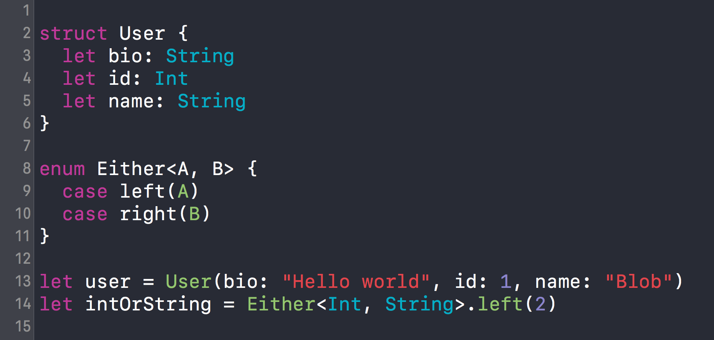
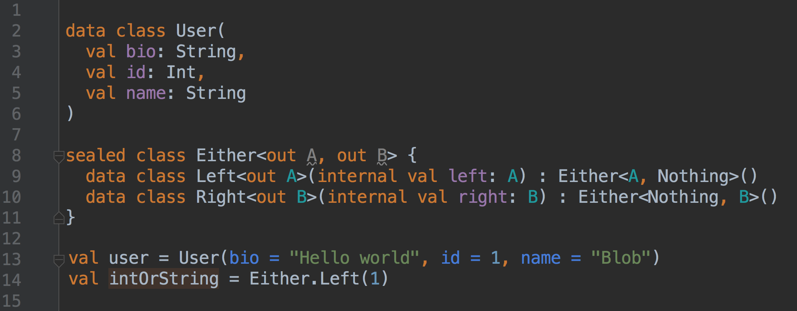
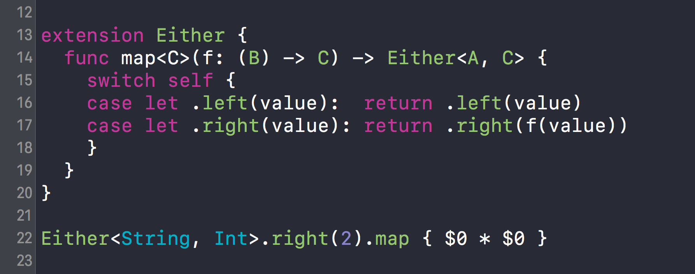
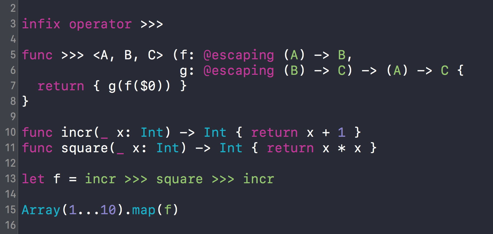
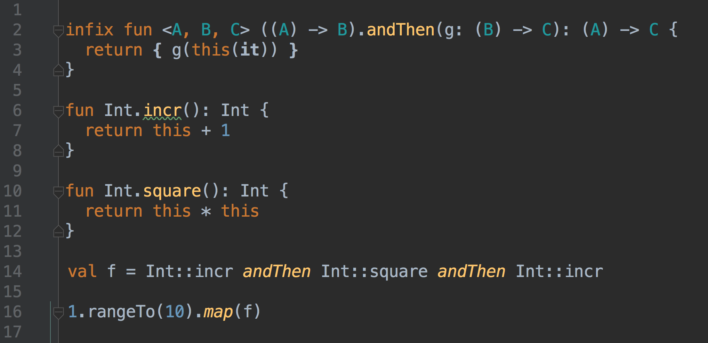

build-lists: true
theme: Ostrich, 1

### Anything you can do,
### I can do better...

^ Hello! I'm Brandon, and [I'm] Lisa, we're engineers on the native team at Kickstarter, doing both iOS and Android. We're a pretty small team of engineers, ranging from junior to senior, and we've been on a journey for the past 2 years of unifying our foundations across iOS and Android.

^ For example, I was originally hired as an iOS engineer at Kickstarter, but jumped onto Android when we started working on our 1.0

^ Lisa on the other hand was hired as an Android engineer, but happily started writing Swift when we started on our rewrite and re-architecture.

^ But we always had a few core ideas that we held closely so that we could share knowledge while working on two platforms even though we couldn't necessarily share code.

^ However, that doesn't mean there isn't still a bit of identity involved. I would still say I primarily identify as an iOS engineer in my day-to-day, and Lisa would probably identify as an android engineer, even though she's given talks at more iOS conferences than Android and has made a guest appearance on Chris and Florian's swift talks :D

^ So, Lisa and I would like to give you a tour of our platforms of choice to show off their strengths and weaknesses, but still hoping to convey that really we're all just doing the same thing if you embrace a few core ideas.

--- 

### Kotlin **&** Swift

^ Let's start with the language we use for our respective platforms.

^ [Lisa] So everyone here is clearly already familiar with Swift, but you may not have heard of Kotlin.

---

# Kotlin

* JVM language
* Built by JetBrains
* 100% interop with Java
* OOP with a bit of FP
* Very expressive

^ [Lisa] It's a JVM language that is built by JetBrains, the makers of Android Studio, the most popular IDE for android, and IntelliJ.

^ [Lisa] Its aim is to have 100% interop with Java, which is a bit different from Swift. They want all Kotlin code to be reachable from Java. This is a great thing, but also holding Kotlin back a bit.

^ [Lisa] It has a similar philosophy as Swift in that it's primarily an OOP language but has given a few small FP features.

^ [Lisa] And it is _very_ expressive in some really beautiful ways that we'll get into soon.

---

# Optionals

### Swift

^ [brandon] Ok, so one of the nice features of swift is the optional type. It allows you to safely express the idea of the absence of a value. So here, I have an array of integers and I want to add one to the first element. Swift is stopping me from doing this because it cannot know that the array of `xs` is not empty. I have to explicitly handle the case that the array is empty and `first` returns `nil`.

---

# Optionals

### Kotlin

^ [Lisa] Yeah, optionals and null-safety are great. Fortunately Kotlin has made this a first-class concern. Here we see how we have to explicitly tell kotlin that `x` can hold a `null` value, and in the case of `y` Kotlin has prevented us from storing `null` since we have marked its type as a non-nullable `Int`.

^ We also have an array of intergers and this `firstOrNull` method, which behaves like swift's `first` method, and again kotlin is preventing us from adding `1` to an optional integer.

---

# Structs and Enums

---

# Data classes and Sealed Classes

^ yeah, the `either` seems a lil verbose--this `sealed class`, `data class` syntax is essentially an OOP way to use an enum in Kotlin--BUT this has 100% interop with java. which means we get to use it from all of our java code (and we do)

^ whereas in swift a swift `either` enum is not accessible from objective-c at all.

---

# Extensions, Closures and Destructuring

---

# Extensions, Closures and Destructuring

^ With `when`, we have compile time safety that we handled both the left and the right cases.

---

# Extensions, Closures and Destructuring
### Even better...

^ Even better, we can write this function as an expression. We can use this syntax in Kotlin because `when` is treated as an expression.

^ and just to remind everyone, this is fully interoperable with java. we can construct `Either` values, call kotlin functions that accept and return `Either`s, all from Java.

--- 

# Operators

---

# Operators

^ similar to swift, only downside is we can't use symbols for our operators

---

# Tail recursion
### Kotlin

^ [lisa] There's a cool feature of Kotlin that allows us to specify when a recursive function can take advantage of tail recursion

^ This allows for us to write recursive functions, that we'd typically write using a loop, without worrying about stack overflow. Kotlin reads this `tailrec` modifier and expects the last call of the recursion to be the function, and raises a compiler warning when no tail call is found.

^ The compiler then unrolls the recursion into a plain ol' loop

---

# Tail recursion
### Swift 😭

---

### Functional Programming

---

---

^ val/var vs let/var semantics
^ optionals!
^ sum types
^ friendlier syntax for arrays and dictionaries
^ map/filter/reduce
^ Either
^ point free
^ tailrecur
^ if/switch expressions
^ possible to copy-paste some swift code and live rewrite it in kotlin in android studio?
^ interop
^ live code: either
