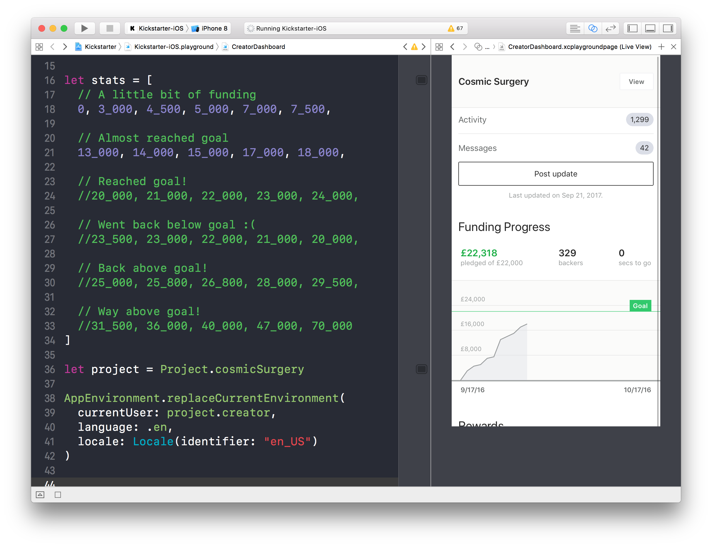
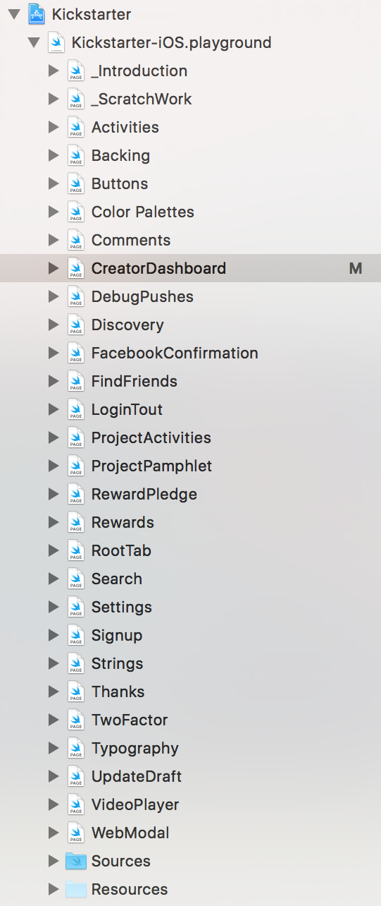

build-lists: true
theme: Fira, 4

# [fit] Playground Driven Development
#### Brandon Williams – @mbrandonw

^

---

# [fit] What is “_____ Driven Development”?

* Test
* Behavior
* Type
* Playground

^ It's mostly a way to make a development methodology seem far more important than it really is.

^ What I mean by playground driven development is that you build your application by spending a large part of your time in playgrounds. you build out views almost entirely in playgrounds.

---
[.build-lists: false]

# [fit] Requirements

* Views can be isolated

^ Your views need to be able to operate when instantiated in isolation. This has two parts to it:

---
[.build-lists: false]

# [fit] Requirements

* Views can be isolated
* No side effects

^ todo

---
[.build-lists: false]

# [fit] Requirements

* Views can be isolated
* No side effects
* Dependencies handled

^ todo

---
[.build-lists: false]

# [fit] Requirements

* Views can be isolated
* No side effects
* Dependencies handled
* `import AppFramework`

^ When you drag a playground into an Xcode project or workspace, it immediately gets access to all of the frameworks in that project/workspace. However, it does not get access to anything in the application target, the thing that is actually build into an IPA and installed on devices. So, if you want to experiment with this you have extract out all of the application code to another framework, you could just call it `AppFramework`. then your application target pretty much only contains the app delegate, and imports `AppFramework` so that you have access to all of that.

---
[.build-lists: false]

# [fit] Requirements

* Views can be isolated
* No side effects
* Dependencies handled
* `import AppFramework`
* Handle bundles

^ Once you move everything to an additional framework, it all the sudden becomes important to know about bundles. I never really cared about em before this, I just always used `Bundle.main` and everything worked. Now, however, your assets, storyboards, XIBs are tied to a bundle that isnt the main one. It's easy to solve this, but you have to be aware of it.

---

# [fit] Pros

* Test in isolation
* Living documentation
* Control simulator settings better
* Works with all the iOS technologies

^ Playgrounds allow you to test your views in complete isolation. When you test in the simulator or

^ Playgrounds becoming living documentation and style guide of your code base and application. Tests are for capturing nuanced logic in your application, playgrounds are for capturing broad visual styles and checking out different states. the playgrounds can also be structured as a lil mini tutorial on what the screen has to offer. more on that soon

^ You can control things that are typically a bit of a pain in the simulator or a device. TODO

^ Asset catalogue, storyboards, XIBs, prototype cells, ... A playground is just a lil mini simulator running in Xcode.

---

# [fit] An example from Kickstarter
#### https://www.github.com/kickstarter/ios-oss

^ we did this playground stuff a lot at kickstarter.

---

^ here's one such playground. on the right you see the creator dashboard, the screen where creators could see top level stats of how their project is doing, view activity, send messages to backers, and post updates.

^ on the left is a small sample of all the things you can tweak to completely re-render the screen.

^ you can uncomment out some of these numbers to make the graph show more data

---

^ uncommenting line 21 makes some more data points come in

---

^ here i uncommented line 24 and a few more data points came in. in particular, the project is now over its funding goal so the graph changes slightly

---

^ uncommenting 27 shows what happens when the graph goes back below the goal

---

^ and then the graph goes back above the goal

---

^ and finally the last set of data points show what happens if we got hockey stick growth out of the graph

---

^ line 36 allows us to change what project is being represented in this playground. we had a bunch of hard coded values for particularly interesting projects that we could play with.

^ here i've brought in charlie kauffman's anomalisa

---

^ line 40 allows us to change the language the app is run in! here i've changed it to german

---

^ and then changed to spanish

---

^ then french of course

---

^ and finally japanese!

---

---

# Cons

* Playground stability
* Infrastructure investment

^ Playgrounds have had a complicated history when it comes to stability. There were even 3 releases, Xcode 8.0, 8.1 and 8.2 in which playgrounds simply did not work. Ever since Xcode 8.3 things have been better.

---

# [fit] Live Demo

---

## [fit] Next steps

* Screenshot testing
* Build playgrounds in CI

^ Once you've take the time to make your views nice and isolated, there's nothing stopping you from doing screenshot testing! This is where during a unit test you load up a view, take a screenshot, and commit it to your repo. Then, at a later time if the test runs and a different screenshot is generated, you get a failed test.

^ Something I've personally never got working but really should have is to have your CI build the playgrounds. Since the playgrounds become an important part of your code's documentation, it's important to make sure they keep building. You dont wanna open a playground from a few months ago to find out it doesnt run and you have to fix a bunch of type errors.

---

#### Playground Driven Development
# [fit] Thanks!
#### Brandon Williams – @mbrandonw
#### https://github.com/mbrandonw/presentations
